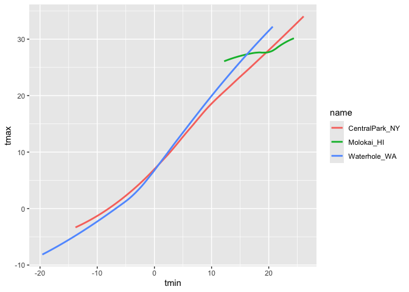
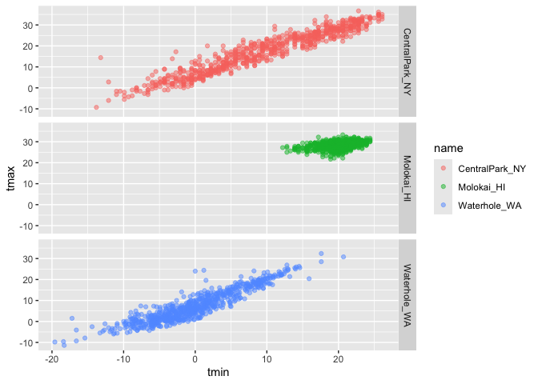
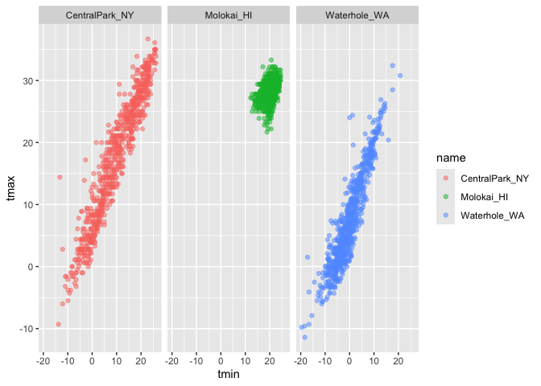
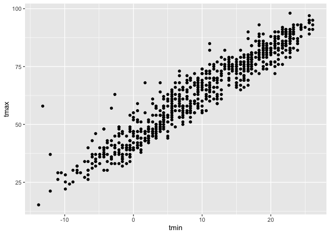
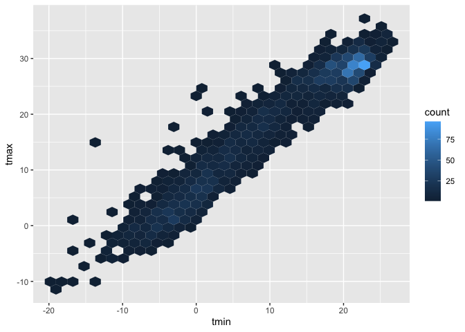
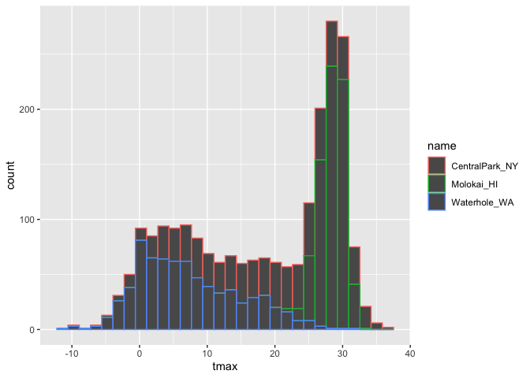
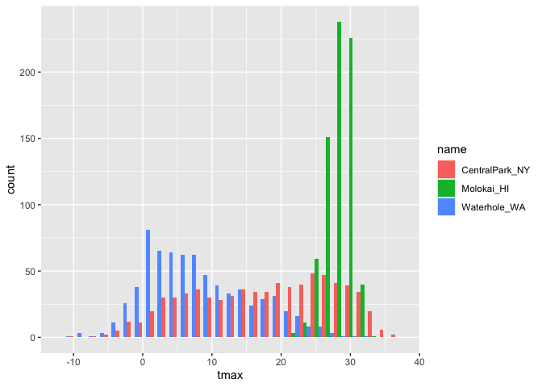
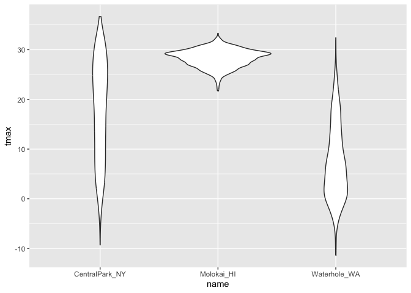
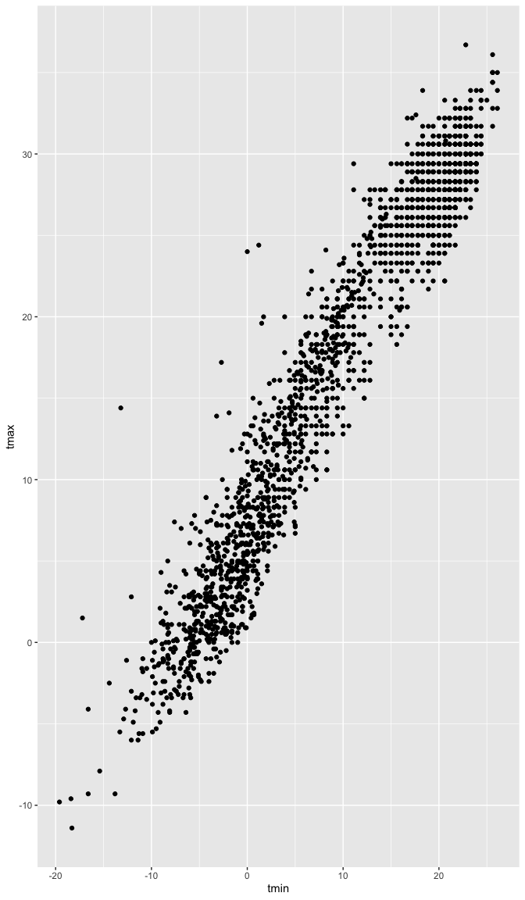

Visualization
================
Madeline Sharp
2026-10-01

``` r
library(tidyverse)
```

    ## ── Attaching core tidyverse packages ──────────────────────── tidyverse 2.0.0 ──
    ## ✔ dplyr     1.2.1     ✔ readr     2.2.0
    ## ✔ forcats   1.0.1     ✔ stringr   1.6.0
    ## ✔ ggplot2   4.0.3     ✔ tibble    3.3.1
    ## ✔ lubridate 1.9.5     ✔ tidyr     1.3.2
    ## ✔ purrr     1.2.2     
    ## ── Conflicts ────────────────────────────────────────── tidyverse_conflicts() ──
    ## ✖ dplyr::filter() masks stats::filter()
    ## ✖ dplyr::lag()    masks stats::lag()
    ## ℹ Use the conflicted package (<http://conflicted.r-lib.org/>) to force all conflicts to become errors

``` r
library(ggridges)

library(p8105.datasets)
data("weather_df")
```

Now we have everything!

``` r
weather_df
```

    ## # A tibble: 2,190 × 6
    ##    name           id          date        prcp  tmax  tmin
    ##    <chr>          <chr>       <date>     <dbl> <dbl> <dbl>
    ##  1 CentralPark_NY USW00094728 2021-01-01   157   4.4   0.6
    ##  2 CentralPark_NY USW00094728 2021-01-02    13  10.6   2.2
    ##  3 CentralPark_NY USW00094728 2021-01-03    56   3.3   1.1
    ##  4 CentralPark_NY USW00094728 2021-01-04     5   6.1   1.7
    ##  5 CentralPark_NY USW00094728 2021-01-05     0   5.6   2.2
    ##  6 CentralPark_NY USW00094728 2021-01-06     0   5     1.1
    ##  7 CentralPark_NY USW00094728 2021-01-07     0   5    -1  
    ##  8 CentralPark_NY USW00094728 2021-01-08     0   2.8  -2.7
    ##  9 CentralPark_NY USW00094728 2021-01-09     0   2.8  -4.3
    ## 10 CentralPark_NY USW00094728 2021-01-10     0   5    -1.6
    ## # ℹ 2,180 more rows

``` r
#don't put in code
#weather_df |> view()
```

Let’s make a scatterplot!

``` r
ggplot(weather_df, aes(x = tmin, y = tmax)) +
  geom_point()
```

    ## Warning: Removed 17 rows containing missing values or values outside the scale range
    ## (`geom_point()`).

<!-- -->

I always like the dataframe first.

``` r
ggp_temp_scatterplot =
  weather_df |>
  ggplot(aes(x = tmin, y = tmax)) +
  geom_point()

ggp_temp_scatterplot
```

    ## Warning: Removed 17 rows containing missing values or values outside the scale range
    ## (`geom_point()`).

<!-- -->

Let’s make this a bit fancier…

``` r
weather_df |>
  ggplot(aes(x = tmin, y = tmax, color = name)) +
  # makes points abit transparent
  geom_point(alpha = .25) +
  # adds a smooth line through the middle. 
  # se = FALSE gets rid of error bars. Jeff prefers no error bars
  geom_smooth(se = FALSE)
```

    ## `geom_smooth()` using method = 'loess' and formula = 'y ~ x'

    ## Warning: Removed 17 rows containing non-finite outside the scale range
    ## (`stat_smooth()`).

    ## Warning: Removed 17 rows containing missing values or values outside the scale range
    ## (`geom_point()`).

<!-- -->

``` r
weather_df |>
  ggplot(aes(x = tmin, y = tmax)) +
  # different aesthetic definition
  geom_point(aes(color = name), alpha = .25) +
  geom_smooth(se = FALSE)
```

    ## `geom_smooth()` using method = 'gam' and formula = 'y ~ s(x, bs = "cs")'

    ## Warning: Removed 17 rows containing non-finite outside the scale range
    ## (`stat_smooth()`).

    ## Warning: Removed 17 rows containing missing values or values outside the scale range
    ## (`geom_point()`).

<!-- -->

The aesthetics are up to you

``` r
# Order: dataset -> mappings -> what you want to see
weather_df |>
  ggplot(aes(x = tmin, y = tmax, color = name)) +
  geom_smooth(se = FALSE)
```

    ## `geom_smooth()` using method = 'loess' and formula = 'y ~ x'

    ## Warning: Removed 17 rows containing non-finite outside the scale range
    ## (`stat_smooth()`).

<!-- -->

Show faceting

``` r
weather_df |>
  ggplot(aes(x = tmin, y = tmax, color = name)) +
  geom_point(alpha = .5) +
  # how you want columns to be separated ". ~ name", i.e., by name
  # classic interface
  facet_grid(. ~ name)
```

    ## Warning: Removed 17 rows containing missing values or values outside the scale range
    ## (`geom_point()`).

<!-- -->

Changing orientation of facet

``` r
weather_df |>
  ggplot(aes(x = tmin, y = tmax, color = name)) +
  geom_point(alpha = .5) +
  facet_grid(name ~.)
```

    ## Warning: Removed 17 rows containing missing values or values outside the scale range
    ## (`geom_point()`).

<!-- -->

``` r
weather_df |>
  ggplot(aes(x = tmin, y = tmax, color = name)) +
  geom_point(alpha = .5) +
  # new interface. Does the same thing as the classic one.
  facet_grid(cols = vars(name))
```

    ## Warning: Removed 17 rows containing missing values or values outside the scale range
    ## (`geom_point()`).

<!-- -->

Let’s look at something else.

``` r
weather_df |>
  # w/o specifications R creates scales on its own, e.g. with dates
  ggplot(aes(x = date, y = tmax, color = name)) +
  geom_point(aes(size = prcp), alpha = .5) +
  geom_smooth(se = FALSE) +
  facet_grid(. ~ name)
```

    ## `geom_smooth()` using method = 'loess' and formula = 'y ~ x'

    ## Warning: Removed 17 rows containing non-finite outside the scale range
    ## (`stat_smooth()`).

    ## Warning: Removed 19 rows containing missing values or values outside the scale range
    ## (`geom_point()`).

<!-- -->

make a plot of central park tmax v tmin only, and convert temperatures
to fahrenheit.

``` r
weather_df |>
  # clean data outside ggplot before plotting
  filter(name == "CentralPark_NY") |>
  mutate(
    tmax = tmax * 9/5 + 32,
    tmix = tmin * 9/5 + 32
  ) |>
  ggplot(aes(x = tmin, y = tmax)) +
  geom_point() 
```

<!-- -->

what’s a hex plot

``` r
weather_df |>
  ggplot(aes(x = tmin, y = tmax)) +
  geom_hex()
```

    ## Warning: Removed 17 rows containing non-finite outside the scale range
    ## (`stat_binhex()`).

<!-- -->

## Univariate plots

``` r
weather_df |>
  ggplot(aes(x = tmax)) +
  geom_histogram()
```

    ## `stat_bin()` using `bins = 30`. Pick better value `binwidth`.

    ## Warning: Removed 17 rows containing non-finite outside the scale range
    ## (`stat_bin()`).

<!-- -->

``` r
weather_df |>
  # Jeff does not like this.
  ggplot(aes(x = tmax, color = name)) +
  geom_histogram()
```

    ## `stat_bin()` using `bins = 30`. Pick better value `binwidth`.

    ## Warning: Removed 17 rows containing non-finite outside the scale range
    ## (`stat_bin()`).

<!-- -->

``` r
weather_df |>
  # Use fill instead
  ggplot(aes(x = tmax, fill = name)) +
  # Jeff does not like this
  geom_histogram(position = "dodge")
```

    ## `stat_bin()` using `bins = 30`. Pick better value `binwidth`.

    ## Warning: Removed 17 rows containing non-finite outside the scale range
    ## (`stat_bin()`).

<!-- -->

``` r
weather_df |>
  ggplot(aes(x = tmax, fill = name)) +
  geom_histogram() +
  # Use this instead
  facet_grid(. ~ name)
```

    ## `stat_bin()` using `bins = 30`. Pick better value `binwidth`.

    ## Warning: Removed 17 rows containing non-finite outside the scale range
    ## (`stat_bin()`).

<!-- -->

Density plots are great!! (Density plots are smoothed out histograms)

``` r
weather_df |>
  ggplot(aes(x = tmax, color = name)) +
  geom_density()
```

    ## Warning: Removed 17 rows containing non-finite outside the scale range
    ## (`stat_density()`).

<!-- -->

``` r
weather_df |>
  # Fill covers some data here. Not good.
  ggplot(aes(x = tmax, fill = name)) +
  geom_density()
```

    ## Warning: Removed 17 rows containing non-finite outside the scale range
    ## (`stat_density()`).

<!-- -->

``` r
weather_df |>
  ggplot(aes(x = tmax, fill = name)) +
  # Use alpha with fill if you want to make the colours more transparent.
  # Otherwise will cover other data. 
  # This is better.
  geom_density(alpha = .3)
```

    ## Warning: Removed 17 rows containing non-finite outside the scale range
    ## (`stat_density()`).

<!-- -->

Boxplots

``` r
# Histograms are better for bimodal dists.
weather_df |>
  ggplot(aes(x = name, y = tmax)) +
  geom_boxplot()
```

    ## Warning: Removed 17 rows containing non-finite outside the scale range
    ## (`stat_boxplot()`).

<!-- -->

Violin - violin plots super popular circa 2018. Same with ridge plots

``` r
weather_df |>
  ggplot(aes(x = name, y = tmax)) +
  # is very useful when you are looking at distributions in many areas
  # e.g. distribution over many US states
  geom_violin()
```

    ## Warning: Removed 17 rows containing non-finite outside the scale range
    ## (`stat_ydensity()`).

<!-- -->

Ridge plots…

``` r
weather_df |>
  ggplot(aes(x = tmax, y = name)) +
  # is very useful when you are looking at distributions in many areas
  # e.g. distribution over many US states
  # more useful than others for this
  geom_density_ridges()
```

    ## Picking joint bandwidth of 1.54

    ## Warning: Removed 17 rows containing non-finite outside the scale range
    ## (`stat_density_ridges()`).

<!-- -->

Remember what aesthetic mapping make sense!

## Save some of the plots

``` r
ggp_weather = 
  weather_df |>
  ggplot(aes(x = date, y = tmax, color = name)) +
  geom_point(aes(size = prcp), alpha = .5) +
  facet_grid(. ~ name)

ggp_weather
```

    ## Warning: Removed 19 rows containing missing values or values outside the scale range
    ## (`geom_point()`).

<!-- -->

``` r
ggsave("ggp_weather.pdf", ggp_weather)
```

    ## Saving 7 x 5 in image

    ## Warning: Removed 19 rows containing missing values or values outside the scale range
    ## (`geom_point()`).

``` r
# if you find yourself saving a lot of images, save them into a subfolder
```

``` r
weather_df |>
  ggplot(aes(x = tmin, y = tmax)) +
  geom_point()
```

    ## Warning: Removed 17 rows containing missing values or values outside the scale range
    ## (`geom_point()`).

<!-- -->

``` r
# figure out whatthis does
#knitr::opts_chunk$set(
#  fig.width = 6,
#  fig.asp = .6,
#  out.width = "90%"
#)
```
